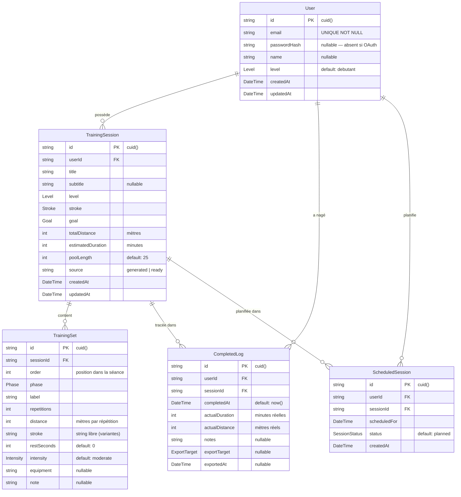

# Modèle de données — Swim

Base de données : **PostgreSQL** (Neon serverless)  
ORM : **Prisma 7** — schéma source : [`prisma/schema.prisma`](../prisma/schema.prisma)

---

## Diagramme entité-relation

---

## Description des tables

### `User`
Compte utilisateur. Supporte deux modes d'authentification : credentials (email + mot de passe haché) et OAuth Google (pas de `passwordHash`).

| Colonne | Type | Contraintes | Description |
|---------|------|-------------|-------------|
| `id` | `String` | PK, cuid() | Identifiant opaque |
| `email` | `String` | UNIQUE, NOT NULL | Email de connexion, stocké en minuscules |
| `passwordHash` | `String?` | nullable | Hash bcrypt (cost 12). `null` si compte Google OAuth |
| `name` | `String?` | nullable | Nom d'affichage |
| `level` | `Level` | default `debutant` | Niveau natation de l'utilisateur |
| `createdAt` | `DateTime` | auto | Date de création du compte |
| `updatedAt` | `DateTime` | auto | Dernière mise à jour |

---

### `TrainingSession`
Séance d'entraînement, qu'elle soit générée par l'algorithme (`source = "generated"`) ou issue de la bibliothèque prédéfinie (`source = "ready"`).

| Colonne | Type | Contraintes | Description |
|---------|------|-------------|-------------|
| `id` | `String` | PK, cuid() | — |
| `userId` | `String` | FK → `User.id` ON DELETE CASCADE | Propriétaire |
| `title` | `String` | NOT NULL | Titre, modifiable par l'utilisateur |
| `subtitle` | `String?` | nullable | Sous-titre généré (nage · niveau · objectif) |
| `level` | `Level` | NOT NULL | Niveau ciblé |
| `stroke` | `Stroke` | NOT NULL | Nage principale |
| `goal` | `Goal` | NOT NULL | Objectif de la séance |
| `totalDistance` | `Int` | NOT NULL | Distance totale en mètres |
| `estimatedDuration` | `Int` | NOT NULL | Durée estimée en minutes |
| `poolLength` | `Int` | default 25 | Longueur du bassin (25 ou 50 m) |
| `source` | `String` | default `"generated"` | Origine de la séance |
| `createdAt` | `DateTime` | auto | — |
| `updatedAt` | `DateTime` | auto | — |

**Index** : `userId`, `createdAt DESC`

---

### `TrainingSet`
Série individuelle au sein d'une séance. L'ordre d'affichage est déterminé par `order`.

| Colonne | Type | Contraintes | Description |
|---------|------|-------------|-------------|
| `id` | `String` | PK, cuid() | — |
| `sessionId` | `String` | FK → `TrainingSession.id` ON DELETE CASCADE | Séance parente |
| `order` | `Int` | NOT NULL | Position dans la séance (0-based) |
| `phase` | `Phase` | NOT NULL | `warmup` / `drills` / `main` / `cooldown` |
| `label` | `String` | NOT NULL | Libellé affiché à l'utilisateur |
| `repetitions` | `Int` | NOT NULL | Nombre de répétitions |
| `distance` | `Int` | NOT NULL | Distance par répétition (mètres) |
| `stroke` | `String` | NOT NULL | Nage en texte libre (gère "4nages" et variantes) |
| `restSeconds` | `Int` | default 0 | Repos entre répétitions (secondes) |
| `intensity` | `Intensity` | default `moderate` | Effort cible |
| `equipment` | `String?` | nullable | Matériel suggéré (planche, pull-buoy…) |
| `note` | `String?` | nullable | Consigne technique ou note coach |

---

### `CompletedLog`
Entrée créée lorsqu'un utilisateur marque une séance comme complétée. Source principale des statistiques du tableau de bord.

| Colonne | Type | Contraintes | Description |
|---------|------|-------------|-------------|
| `id` | `String` | PK, cuid() | — |
| `userId` | `String` | FK → `User.id` ON DELETE CASCADE | — |
| `sessionId` | `String` | FK → `TrainingSession.id` ON DELETE CASCADE | Séance nagée |
| `completedAt` | `DateTime` | default now() | Horodatage de complétion |
| `actualDuration` | `Int` | NOT NULL | Durée réelle en minutes |
| `actualDistance` | `Int` | NOT NULL | Distance réelle en mètres |
| `notes` | `String?` | nullable | Notes libres post-séance |
| `exportTarget` | `ExportTarget?` | nullable | Cible d'export si exportée (`garmin` / `coros` / `pdf`) |
| `exportedAt` | `DateTime?` | nullable | Horodatage de l'export |

**Index** : `userId`, `completedAt DESC`

---

### `ScheduledSession`
Planification calendaire d'une séance. Le modèle existe en base mais **l'interface utilisateur n'est pas encore connectée** (cf. section Out of scope du README).

| Colonne | Type | Contraintes | Description |
|---------|------|-------------|-------------|
| `id` | `String` | PK, cuid() | — |
| `userId` | `String` | FK → `User.id` ON DELETE CASCADE | — |
| `sessionId` | `String` | FK → `TrainingSession.id` ON DELETE CASCADE | Séance planifiée |
| `scheduledFor` | `DateTime` | NOT NULL | Date prévue |
| `status` | `SessionStatus` | default `planned` | `planned` / `completed` / `cancelled` |
| `createdAt` | `DateTime` | auto | — |

---

## Énumérations

| Enum | Valeurs |
|------|---------|
| `Level` | `debutant` · `intermediaire` · `avance` |
| `Stroke` | `crawl` · `dos` · `brasse` · `papillon` · `four_nages` |
| `Goal` | `endurance` · `technique` · `vitesse` · `recuperation` |
| `Phase` | `warmup` · `drills` · `main` · `cooldown` |
| `Intensity` | `easy` · `moderate` · `hard` · `sprint` |
| `ExportTarget` | `garmin` · `coros` · `pdf` |
| `SessionStatus` | `planned` · `completed` · `cancelled` |

---

## Notes de conception

- **Clés primaires** : `cuid()` — opaques, non-séquentiels, adaptés aux URLs publiques.
- **Suppressions en cascade** : supprimer un `User` efface toutes ses sessions, logs et planifications. Supprimer une `TrainingSession` efface ses `TrainingSet`, `CompletedLog` et `ScheduledSession`.
- **`TrainingSet.stroke` en String** : contrairement aux autres tables, la nage est stockée en texte libre pour gérer la valeur `"4nages"` qui n'est pas un identifiant SQL valide dans l'enum `Stroke` (lequel utilise `four_nages` en base).
- **`ScheduledSession`** : table présente mais non connectée côté UI. Elle pourra alimenter une vue calendaire sans migration supplémentaire.
